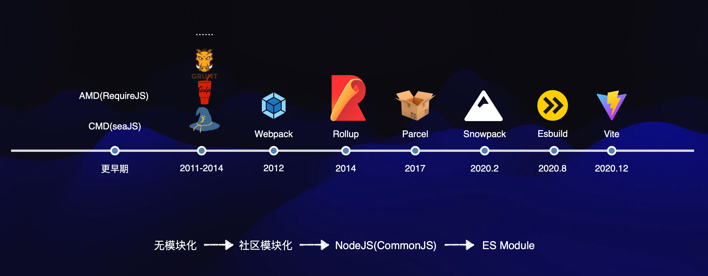
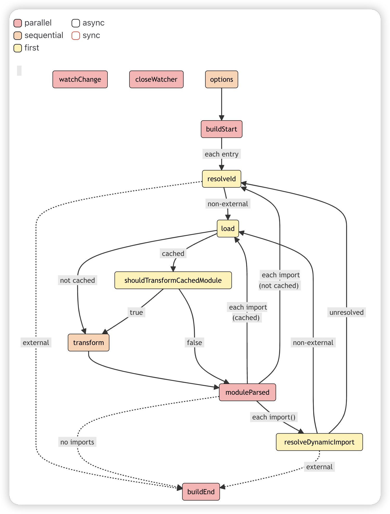
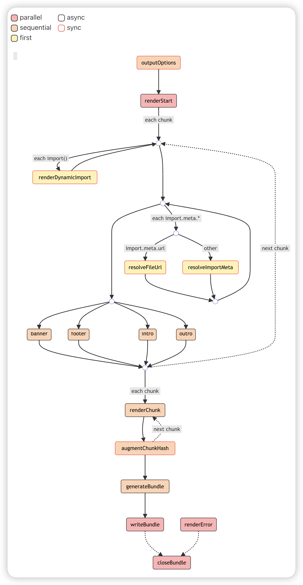

# rollup

本文收录在掘金专栏《15天带你精通现代前端工具链生态》：https://juejin.cn/column/7287224080172302336



## 除屑优化(tree shaking)

除了可以使用 ES 模块之外，Rollup 还可以静态分析你导入的代码，并将排除任何实际上没有使用的内容，从上面的引入和最后的打包结果就可以看到，没有使用到的内容直接被删除了。

> 注意，**除屑优化的核心思想是在编译阶段通过静态分析确定代码的使用情况，而不是在运行时**。

所以除屑优化一般是建立在**ES6 模块化语法**基础之上的，ESM的导入导出是静态的。

CommonJS 模块的导入和导出是动态的，无法在编译阶段静态确定代码的使用情况。一般情况下，除屑优化工具无法在 CommonJS 模块中进行精确的摇树，因为无法静态分析模块间的导入和导出关系。

然而，一些构建工具（如 Webpack）会尝试通过静态分析和启发式方法对 CommonJS 模块进行近似的除屑优化。它们会尽可能地识别出那些可以在编译阶段确定未被使用的代码，并进行剔除。但这种处理方式可能不如对 ES6 模块的优化效果好，且有一定的限制。

**除屑优化的原理：**

1. 静态分析：对 JavaScript 代码进行静态分析，识别出模块的导入和导出关系。
2. 标记未使用代码：标记出在导入和导出关系上没有被使用的代码。这些代码可能是模块的导出函数、变量、类等。
3. 剔除未使用代码：根据标记结果，构建工具会将未被使用的代码从最终的打包结果中剔除，只保留被使用的部分。

由于是静态分析，所以我们在写代码的时候，需要注意自己的写法，简单来说，尽量的使用最小导入，比如你可以比较一下我们这里导入代码之后，打包的区别：

```javascript
// 直接默认导入整个对象
import util from './util.js'
const r = util.getRandomNum(1, 10)
console.log(r)

// 具名导入具体的函数
import { getRandomNum } from './util.js'
const r = getRandomNum(1, 10)
console.log(r)
```

## 与webpack打包的区别

这个打包结果其实就已经和我们熟知的**webpack**有了很鲜明的区别，我们把webpack安装一下试试

```shell
pnpm add webpack webpack-cli -D
```

运行webpack-cli：

```shell
# --entry 入口文件 -o 打包文件夹位置 --mode 打包模式
npx webpack --entry ./src/index.js -o dist --mode development
```

当然我们可以选择生成模式进行打包

```shell
npx webpack --entry ./src/index.js -o dist --mode production
```

```javascript
;(() => {
  'use strict'
  const o =
    ((t = 1),
    (a = 10),
    (t = Math.ceil(t)),
    (a = Math.floor(a)),
    Math.floor(Math.random() * (a - t + 1)) + t)
  var t, a
  console.log(o)
})()
```

现在打包出来的内容就直接是压缩之后的代码了

## 配置文件

`Rollup`配置文件是一个 ES 模块。通常，它被称为 `rollup.config.js` 或 `rollup.config.mjs`，并位于项目的根目录中。它导出一个默认对象，其中包含所需的选项：

```javascript
export default {
  input: 'src/index.js',
  output: {
    file: 'dist/bundle.js',
    format: 'esm',
  },
}
```

> **注意**：nodejs环境下要运行esm模块化的内容，要么文件名后缀处理为**.mjs**，要么package.json文件中配置**"type":"module"**，因为 Rollup 将遵循 [Node ESM 语义](https://nodejs.org/docs/latest-v14.x/api/packages.html#packages_determining_module_system)。

# 常用配置

## 多产物配置

我们可以将 output 改造成一个数组，对外暴露出不同格式的产物供他人使用，不仅包括 `ESM`，也需要包括诸如`CommonJS`、`UMD`等格式，保证良好的兼容性

```javascript
import { defineConfig } from 'rollup'

export default defineConfig({
  input: 'src/index.js',
  output: [
    {
      file: 'dist/bundle-iife.js',
      format: 'iife',
    },
    {
      file: 'dist/bundle-esm.js',
      format: 'esm',
    },
    {
      file: 'dist/bundle-cjs.js',
      format: 'cjs',
    },
    {
      file: 'dist/bundle-umd.js',
      format: 'umd',
      name: 'bundle',
    },
  ],
})
```

## 多入口配置

除了多产物配置，Rollup 中也支持多入口配置

**main.js**

```javascript
// src/main.js
import util from './util.js'
const r = util.getRandomNum(1, 10)
console.log('🚀 ~ r:', r)

const obj = {
  a: 1,
  b: {
    c: 3,
  },
}
const cloneObj = util.deepClone(obj)
cloneObj.b.c = 4
console.log('🚀 ~ obj:', obj)
console.log('🚀 ~ cloneObj:', cloneObj)
```

**rollup.config.js**

```javascript
import { defineConfig } from 'rollup'

export default defineConfig({
  input: ['src/index.js', 'src/main.js'],
  output: [
    {
      dir: 'dist',
      format: 'cjs',
    },
  ],
})
```

通常情况下多产物和多入口两者会被结合起来使用

```javascript
import { defineConfig } from 'rollup'
export default defineConfig({
  input: ['src/index.js', 'src/main.js'],
  output: [
    {
      dir: 'cjs',
      format: 'cjs',
    },
    {
      dir: 'esm',
      format: 'esm',
    },
  ],
})
```

当然，上面这样的写的话，生成的产物会把两个入口一起进行构建，我们可能的想法是一个入口一种构建方式：

```javascript
import { defineConfig } from 'rollup'
/**
 * @type {import('rollup').RollupOptions}
 */
const buildIndexOptions = {
  input: 'src/index.js',
  output: {
    dir: 'dist/umd/',
    format: 'umd',
    name: 'bundle',
  },
}

/**
 * @type {import('rollup').RollupOptions}
 */
const buildMainOptions = {
  input: 'src/main.js',
  output: {
    dir: 'dist/esm/',
    format: 'esm',
  },
}
export default [buildIndexOptions, buildMainOptions]
```

## 动态导入与默认代码分割

使用路由来说明懒加载是大家喜闻乐见的方式，估计大多数同学对于懒加载都只是停留在路由的懒加载，其实，任何时候，我们都可以使用import动态懒加载的方式。重新编辑一下main.js入口：

```javascript
// src/main.js
function run() {
  // 如果不清楚import动态导入返回的是什么，可以先打印一下下面结果
  // import("./util.js").then(chunk => console.log("🚀 ~ chunk:", chunk));

  import('./util.js').then(({ default: foo }) => {
    const r = foo.getRandomNum(1, 10)
    console.log('🚀 ~ r:', r)
  })
}
run()
```

重新运行可以看到dist目录形成了下面的结构:

```shell
.
├── dist
│   ├── esm
│   │   ├── main.js
│   │   └── util-371e3ef9.js
│   └── umd
│       └── index.js
└── ...
```

Rollup 将使用动态导入创建一个仅在需要时加载的单独块。所以你可以看到这里多了一个`util-371e3ef9.js`的文件

> **注意：**为了让 Rollup 知道在哪里放置第二个块，我们不使用 `--file` 选项，而是使用 `--dir` 选项设置一个输出文件夹

其中，`util-371e3ef9.js`是自动生成的`chunk-[hash].js`的名字，`[hash]` 是基于内容的哈希字符串。你可以通过指定 [`output.chunkFileNames`](https://cn.rollupjs.org/configuration-options/#output-chunkfilenames) (chunk文件)和 [`output.entryFileNames`](https://cn.rollupjs.org/configuration-options/#output-entryfilenames) (打包入口文件)选项来提供自己的命名模式。

```javascript
/**
 * @type {import('rollup').RollupOptions}
 */
const buildMainOptions = {
  input: 'src/main.js',
  output: {
    dir: 'dist/esm/',
    entryFileNames: '[name].js',
    chunkFileNames: 'chunk-[name]-[hash].js',
    format: 'esm',
  },
}
```

而且，很智能的是，如果这个时候，我定义了又多个入口点都调用了`util.js`文件，会自动的引入分割出来的文件

```javascript
/**
 * @type {import('rollup').RollupOptions}
 */
const buildMainOptions = {
  input: ['src/main.js', 'src/main2.js'],
  output: {
    dir: 'dist/esm/',
    entryFileNames: '[name].js',
    chunkFileNames: 'chunk-[name]-[hash].js',
    format: 'esm',
  },
}
```

在打包后的main2.js中，可以看到这样的引用：

```javascript
import util from './chunk-util-371e3ef9.js'
```

## 使用插件

到目前为止，我们已经用入口文件和通过相对路径导入的模块打了一个简单的包。随着你需要打包更复杂的代码，通常需要更灵活的配置，例如导入使用 NPM 安装的模块、使用 Babel 编译代码、处理 JSON 文件等等。

插件列表 ： [the Rollup Awesome List](https://github.com/rollup/awesome)。

### [@rollup/plugin-node-resolve](https://github.com/rollup/plugins/tree/master/packages/node-resolve)

比如我们现在引入lodash-es库

```shell
pnpm add lodash-es -D
```

在index.js中使用

```javascript
import { chunk } from 'lodash-es'
const r = chunk([1, 2, 3, 4], 2)
console.log('🚀 ~ r:', r)
```

现在直接打包

```javascript
/**
 * @type {import('rollup').RollupOptions}
 */
const buildIndexOptions = {
  input: 'src/index.js',
  output: {
    dir: 'dist/esm/',
    format: 'esm',
  },
}
export default buildIndexOptions
```

会出现下面的警告：

```shell
src/index.js → dist/esm/...
(!) Unresolved dependencies
https://rollupjs.org/troubleshooting/#warning-treating-module-as-external-dependency
lodash-es (imported by "src/index.js")
created dist/esm/ in 13ms
```

意思是，不能解析`lodash-es`这个依赖，报出了警告，问你是不是需要`external`，并提示你点击链接有这个警告的解释。当我们点击这个链接，按照提示解决这个external警告问题，很简单，就加上external，也就是把`lodash-es`这个库给排除出去

```diff
const buildIndexOptions = {
  input: 'src/index.js',
  output: {
    dir: 'dist/esm/',
    format: 'esm',
  },
+  external: ['lodash-es']
}
export default buildIndexOptions
```

再此打包，果然没警告了，而且我们在nodejs环境中确实也能正常运行了

> **注意：对于没有太多开发经验的同学来说，这里感觉问题解决了，但是需要理解为什么**
>
> **注意：对于没有太多开发经验的同学来说，这里感觉问题解决了，但是需要理解为什么**
>
> **注意：对于没有太多开发经验的同学来说，这里感觉问题解决了，但是需要理解为什么**

重要的事情说三遍，这里虽然看似一个很小的问题，但是却有很多基本理论点

1、rollup默认只能解析导入的相对路径，也就是`/` ， `./`或者`../`开头的路径，对于`bare import`，也就是`import { chunk } from 'lodash-es';`这种直接导入的第三方包的格式，并不支持

2、`rollup`相比`webpack`最大的优势并不是构建一个足够大的应用打包，大多是情况下，我们使用`rollup`用来构建工具库，因此，这里导入的`lodash-es`并没有报错，而仅仅报出警告，因为`rollup`认为`lodash-es`这个库并没有加入构建，那么你的意思是将来用作第三方库来使用，因此将`lodash-es`使用配置`external`排除掉就好。

3、`lodash-es`这个包本身就是支持ESM的

4、最后打包好的`index.js`文件只所以在`nodejs`环境下运行，是因为`nodejs`可以帮我们解析`bare import`，我们可以试着将`index.js`放入到`html`文件中运行，你就可以看到其中的问题所在，在html环境中就会报错了：`index.html:1 Uncaught TypeError: Failed to resolve module specifier "lodash-es". Relative references must start with either "/", "./", or "../".`

如果希望在最后的打包中，将`lodash-es`内容解析打包进去，就可以使用`@rollup/plugin-node-resolve`

**安装:**

```shell
pnpm add @rollup/plugin-node-resolve --save-dev
```

**使用：**

```javascript
import { nodeResolve } from '@rollup/plugin-node-resolve'
/**
 * @type {import('rollup').RollupOptions}
 */
const buildIndexOptions = {
  input: 'src/index.js',
  output: {
    dir: 'dist/esm/',
    format: 'esm',
  },
  plugins: [nodeResolve()],
  // external: ['lodash-es']
}
export default buildIndexOptions
```

现在，再此进行打包，无论是打包时间，还是打包内容和之前都很不一样了，把`lodash-es`中，关于`chunk()`函数的内容，都打包进了`index.js`文件中

### [output.manualChunks](https://cn.rollupjs.org/configuration-options/#output-manualchunks)

上面讲了对于动态加载模块，rollup帮我们自动做了代码分割，其实我们也可以手动的操作，直接在rollup配置中声明

```javascript
const buildIndexOptions = {
  input: 'src/index.js',
  output: {
    dir: 'dist/esm/',
    format: 'esm',
    entryFileNames: '[name].js',
    chunkFileNames: 'chunk-[name]-[hash].js',
    manualChunks: {
      'lodash-es': ['lodash-es'],
    },
    //也可以是函数形式
    // manualChunks(id){
    //   if(id.includes('lodash-es')){
    //     return 'lodash-es'
    //   }
    // }
  },
  plugins: [nodeResolve()],
}
```

### [@rollup/plugin-commonjs](https://github.com/rollup/plugins/tree/master/packages/commonjs)

上面最开始导入`lodash-es`，没有加入`external`和`plugins`，之所以还能直接运行，还因为`lodash-es`本身就是支持ESM的，因为rollup默认并不支持Commonjs模块化，比如将lodash-es换位lodash，马上就能看到不一样的效果,直接打包失败

```javascript
[!] RollupError: "chunk" is not exported by "node_modules/.pnpm/lodash@4.17.21/node_modules/lodash/lodash.js", imported by "src/index.js".
https://rollupjs.org/troubleshooting/#error-name-is-not-exported-by-module
```

这个错误在官网上解释的很清楚了，无非就是commonjs没有这种导出，因此我们需要`@rollup/plugin-commonjs`帮我们处理commonjs模块化的问题

**安装:**

```shell
pnpm add @rollup/plugin-commonjs --save-dev
```

**使用:**

```diff
import { nodeResolve } from '@rollup/plugin-node-resolve';
+import commonjs from '@rollup/plugin-commonjs';
/**
 * @type {import('rollup').RollupOptions}
 */
const buildIndexOptions = {
  input: 'src/index.js',
  output: {
    dir: 'dist/esm/',
    format: 'esm',
  },
+  plugins: [nodeResolve(), commonjs()]
}
export default buildIndexOptions
```

### [@rollup/plugin-babel](https://github.com/rollup/plugins/tree/master/packages/babel)

使用 [Babel](https://babeljs.io/) 来使用尚未被浏览器和 Node.js 支持的最新 JavaScript 特性。

使用 Babel 和 Rollup 最简单的方法是使用 [@rollup/plugin-babel](https://github.com/rollup/plugins/tree/master/packages/babel)

**安装:**

```shell
pnpm add @rollup/plugin-babel -D
```

**使用：**

```diff
import { nodeResolve } from '@rollup/plugin-node-resolve';
import commonjs from '@rollup/plugin-commonjs';
+import babel from '@rollup/plugin-babel';
/**
 * @type {import('rollup').RollupOptions}
 */
const buildIndexOptions = {
  input: 'src/index.js',
  output: {
    dir: 'dist/esm/',
    format: 'esm',
  },
  plugins: [
    nodeResolve(),
    commonjs(),
+    babel({ babelHelpers: 'bundled' })
  ]
}
export default buildIndexOptions
```

不过这么做之后，打包代码并不会有什么变化，因为我们都知道babel是需要预设的.

安装 [`babel-core`](https://babeljs.io/docs/en/babel-core) 和 [`env`](https://babeljs.io/docs/en/babel-preset-env) 预设

```javascript
pnpm add -D @babel/core @babel/preset-env
```

在 Babel 实际编译代码之前，需要进行配置。在项目根目录创建一个名为 `.babelrc.json` 的新文件

```javascript
{
  "presets": ["@babel/preset-env"]
}
```

具体的babel设置，可以参考[**babel文档**](https://babeljs.io/docs/config-files#project-wide-configuration)

#### 题外话：@babel/runtime

我们在`index.js`代码中加入如下的api

```javascript
import { getRandomNum } from './util.js'
const r = getRandomNum(1, 10)
console.log(r)

const arr = [1, 2, 3, 4].map((item) => item * item)
console.log('🚀 ~ arr:', arr)

Promise.resolve(1).then((res) => {
  console.log(res)
})
```

我们通过babel处理之后会发现一些问题：

@babel/preset-env 只转换了语法，也就是我们看到的箭头函数、const一类，但是对于进一步需要转换内置对象、实例方法等等API，就显得无能为力了，这些代码需要**polyfill(兼容性垫片)**。所以这个我需要`@babel/runtime`来帮我们处理。

`@babel/runtime`是一个核心， 一种实现方式，但是在实现polyfill垫片的过程中，可能会产生很多重复的代码，所以需要`@babel/plugin-transform-runtime`防止污染全局， 抽离公共的 helper function , 防止冗余，当然在处理polyfill的时候，我们还需要core-js的辅助，基于babel，我们可以使用`@babel/runtime-corejs3`

**安装：**

```javascript
pnpm add @babel/plugin-transform-runtime -D
pnpm add @babel/runtime @babel/runtime-corejs3
```

要使用`@babel/plugin-transform-runtime`，`@rollup/plugin-babel`的[**babelHelper**](https://github.com/rollup/plugins/tree/master/packages/babel#babelhelpers)处理必须改为runtime

```javascript
import { nodeResolve } from '@rollup/plugin-node-resolve'
import commonjs from '@rollup/plugin-commonjs'
import babel from '@rollup/plugin-babel'
import typescript from '@rollup/plugin-typescript'
/**
 * @type {import('rollup').RollupOptions}
 */
const buildIndexOptions = {
  input: 'src/index.js',
  output: {
    dir: 'dist/esm/',
    format: 'esm',
  },
  plugins: [
    nodeResolve(),
    commonjs(),
    babel({
      babelHelpers: 'runtime',
      include: 'src/**',
      exclude: 'node_modules/**',
      extensions: ['.js', '.ts'],
    }),
    typescript(),
  ],
}
export default buildIndexOptions
```

**.babelrc.json：**

```javascript
{
  "presets": [
    [
      "@babel/preset-env",
      {
        "targets": "> 0.25%, not dead",
        "useBuiltIns": "usage",
        "corejs": 3
      }
    ]
  ],
  "plugins": [
    [
      "@babel/plugin-transform-runtime",
      {
        "corejs": 3
      }
    ]
  ]
}
```

这个时候你再进行构建，会发现打包后的文件多出了一大堆，这其实就是polyfill中的代码。

### [@rollup/plugin-typescript](https://github.com/rollup/plugins/tree/master/packages/typescript)

要使用typescript就需要依赖这个插件，当然这个插件本身还依赖了`typescript`和`tslib`，因此我们需要导入3个包

```shell
pnpm add typescript tslib @rollup/plugin-typescript -D
```

**util.ts**

```javascript
/**
 * 深拷贝
 * @param obj 需要深拷贝的对象
 * @returns 深拷贝对象
 */
export const deepClone = <T>(obj: T): T => {
  if(typeof obj !== 'object' || obj === null) {
    return obj
  }
  const result:any = Array.isArray(obj) ? [] : {};
  for(let key in obj) {
    if(obj.hasOwnProperty(key)) {
      result[key] = deepClone(obj[key])
    }
  }
  return result
}

export const getRandomNum = (min: number, max: number): number => {
  let num = Math.floor(Math.random() * (min - max) + max);
  return num;
}
```

Index.ts

```javascript
import { getRandomNum, deepClone } from './util.ts'
const r = getRandomNum(1, 10)
console.log(r)

const obj = { a: 1, b: { c: 3 } }
const obj2 = deepClone(obj)
obj2.b.c = 4

console.log(obj)
console.log(obj2)
```

当然，配置文件我们也完全可以是ts的

**rollup.config.ts**

```javascript
import { RollupOptions } from "rollup"
import { nodeResolve } from '@rollup/plugin-node-resolve';
import commonjs from '@rollup/plugin-commonjs';
import babel from '@rollup/plugin-babel';
import typescript from '@rollup/plugin-typescript';

const config: RollupOptions = {
  input: 'src/index.ts',
  output: {
    file: 'dist/umd/index.js',
    format: 'umd',
    name: 'rollupDemo',
  },
  plugins: [
    nodeResolve(),
    commonjs(),
    babel({
      babelHelpers: 'runtime',
      include: 'src/**',
      exclude: 'node_modules/**',
      extensions:['.js', '.ts']
    }),
    typescript(),
  ],
}
export default config;
```

**tsconfig.json**

```javascript
{
  "compilerOptions": {
    "module": "esnext",
    "target": "es5",
    "lib": ["esnext", "dom", "dom.iterable"],
    "skipLibCheck": true,

    "moduleResolution": "bundler",
    "noEmit": true,
    "allowImportingTsExtensions":true,
    "resolveJsonModule": true,
    "isolatedModules": true,
  },
  "include": ["src/**/*","rollup.config.ts"],
}
```

> **注意：**别忘记tsconfig.json文件中需要加入rollup.config.ts配置文件,不然要报错

```diff
{
  "compilerOptions": {
    ......
  },
+  "include": ["src/**/*","rollup.config.ts"],
}
```

**运行：**

```shell
npx rollup -c rollup.config.ts --configPlugin typescript
```

# 构建react应用

## node_modules

```shell
# react
pnpm add react react-dom

# @types/react
pnpm add @types/react @types/react-dom -D

# react预设
pnpm add @babel/preset-react -D

# rollup
pnpm add rollup -D

# rollup常规插件
pnpm add @rollup/plugin-node-resolve @rollup/plugin-commonjs -D

# typescript相关
pnpm add typescript tslib @rollup/plugin-typescript -D

# @rollup/plugin-babel相关
pnpm add @rollup/plugin-babel @babel/core @babel/preset-env -D

# @babel/runtime相关
pnpm add @babel/plugin-transform-runtime @babel/runtime @babel/runtime-corejs3 -D

# html文件模板
pnpm add rollup-plugin-generate-html-template -D

# 替换字符串
pnpm add @rollup/plugin-replace -D

# 开发服务器与live server
pnpm add rollup-plugin-serve rollup-plugin-livereload -D

# clear插件
pnpm add rollup-plugin-clear -D

# scss
pnpm add rollup-plugin-scss sass -D

# postcss
pnpm add postcss rollup-plugin-postcss -D

# 图片处理
pnpm add @rollup/plugin-image -D

# nodejs typescript类型
pnpm add @types/node -D

# 别名插件
pnpm add @rollup/plugin-alias -D

# terser
pnpm add @rollup/plugin-terser -D

# visualizer
pnpm add rollup-plugin-visualizer -D
```

## tsconfig.json

```javascript
{
  "compilerOptions": {
    "module": "esnext",
    "target": "es5",
    "lib": ["esnext", "dom", "dom.iterable"],
    "skipLibCheck": true,

    "moduleResolution": "bundler",
    "noEmit": true,
    "allowImportingTsExtensions":true,
    "resolveJsonModule": true,
    "isolatedModules": true,
    "jsx": "preserve",

    "baseUrl": "./",
    "paths": {
      "@/*": ["src/*"]
    },
  },
  "include": ["src/**/*","rollup.config.ts", "global.d.ts"],
}
```

## .babelrc.json

```javascript
{
  "presets": [
    [
      "@babel/preset-env",
      {
        "targets": "> 0.25%, not dead",
        "useBuiltIns": "usage",
        "corejs": 3
      }
    ],
    ["@babel/preset-react"]
  ],
  "plugins": [
    [
      "@babel/plugin-transform-runtime",
      {
        "corejs": 3
      }
    ]
  ]
}
```

## rollup.config.ts

```javascript
import { RollupOptions } from "rollup";
import { nodeResolve } from "@rollup/plugin-node-resolve";
import commonjs from "@rollup/plugin-commonjs";
import babel from "@rollup/plugin-babel";
import typescript from "@rollup/plugin-typescript";
import htmlTemplate from "rollup-plugin-generate-html-template";
import serve from "rollup-plugin-serve";
import livereload from "rollup-plugin-livereload";
import replace from "@rollup/plugin-replace";
import postcss from "rollup-plugin-postcss";
import alias from "@rollup/plugin-alias";
import clear from "rollup-plugin-clear";
import image from "@rollup/plugin-image"
import terser from '@rollup/plugin-terser';
import { fileURLToPath } from "node:url";
import { visualizer } from "rollup-plugin-visualizer";

const config: RollupOptions = {
  input: "src/main.tsx",
  output: {
    dir: "dist/",
    format: "esm",
    name: "rollupDemo",
    sourcemap: true,
    plugins: [terser()],
    entryFileNames: "[name].[hash:6].js",
    chunkFileNames: "chunks/chunk-[name]-[hash].js",
    // 代码分割
    // manualChunks: {
    //   react: ["react", "react-dom"]
    // },
    globals: {
      react: "React",
      "react-dom": "ReactDOM",
    },
    paths: {
      react: "https://cdn.jsdelivr.net/npm/react@18.2.0/+esm",
      "react-dom": "https://cdn.jsdelivr.net/npm/react-dom@18.2.0/+esm",
    }
  },
  external: ["react", "react-dom"],
  plugins: [
    visualizer(),
    nodeResolve({
      extensions: [".js", "jsx", "ts", "tsx"],
    }),
    commonjs(),
    typescript(),
    babel({
      babelHelpers: "runtime",
      include: "src/**",
      exclude: "node_modules/**",
      extensions: [".js", ".ts", "jsx", "tsx"],
    }),
    alias({
      entries: [
        {
          find: "@",
          replacement: fileURLToPath(new URL("src", import.meta.url)),
        },
      ],
    }),
    postcss({
      extensions: [".css"], // 将scss解析成css
      extract: true,
      modules: true,
    }),
    replace({
      preventAssignment: true,
      "process.env.NODE_ENV": JSON.stringify("production"), // 否则会报：process is not defined的错
    }),
    clear({
      targets: ["dist"],
    }),
    htmlTemplate({
      template: "public/index.html",
      target: "dist/index.html",
      attrs: ['type="module"'],
    }),
    image(),
    serve("dist"),
    livereload("src"),
  ],
};
export default config;
```

# npm发包

# npm发布

## node_modules

```shell
# rollup
pnpm add rollup -D

# rollup常规插件
pnpm add @rollup/plugin-node-resolve @rollup/plugin-commonjs -D

# typescript相关
pnpm add typescript tslib @rollup/plugin-typescript -D

# @rollup/plugin-babel相关
pnpm add @rollup/plugin-babel @babel/core @babel/preset-env -D

# lodash-es
pnpm add lodash-es

# @types/lodash-es
pnpm add @types/lodash-es -D
```

## tsconfig.json文件

```javascript
// tsconfig.json
{
  "compilerOptions": {
    "target": "es5",
    "module": "ESNext",
    "declaration": true,// 根据ts文件自动生成.d.ts声明文件和js文件
    "emitDeclarationOnly": true, // 只输出.d.ts声明文件，不生成js文件
    "outDir": "./dist", // 输出目录
		......
  }
}
```

## 本地调试link安装

最终打包的文件夹是dist文件夹，我们可以把package.json文件和README.md文件都拷贝到dist目录中。

npm link地址其实就是全局安装地址：

**mac:** `/usr/local/lib/node_modules/`

**Windows:** `c:\用户(Users)\你的用户名\AppData(隐藏文件夹)\Roaming\npm\node_modules`

[pnpm link](https://pnpm.io/zh/cli/link#pnpm-link---global)

在库文件的dist目录下执行：

```shell
pnpm link --global
```

这个命令会读取package.json文件中的name，作为包文件的名字，你可以理解为，相当于pnpm将我们打包的项目，全局安装在了本地

在目标项目中，使用命令

```javascript
pnpm link --global 包名
```

进行安装。

**卸载link** [pnpm unlink](https://pnpm.io/zh/cli/unlink)

## 发布到npm

常用命令：

- `npm whoami` 检测当前登录状态

- `npm config ls` 显示当前 npm 配置信息

- `npm addUser` 、`npm login` 登录

- `npm config set registry 链接地址` 切换源地址

- `npm publish` 发布

> 注意必须使用npm源镜像才能发布，如果使用的是阿里源等镜像，需要切换成源镜像才能发布 `https://registry.npmjs.org/`

# JavaScript API

Rollup 提供了一个可从 Node.js 使用的 JavaScript API。你很少需要使用它，不过通过这个API我们可以比较明显的知道rollup的构建大致流程。

内容其实并不多，主要核心两个函数，rollup()与watch()

- rollup.rollup
  - inputOptions 对象
  - outputOptions 对象
- rollup.watch
  - watchOptions

其实用起来的基本思路和配置文件差不多。直接来看一下效果：

```javascript
const rollup = require('rollup')

const inputOptions = {
  input: 'src/index.js',
  external: [],
  plugins: [],
}

const outputOptions = {
  dir: 'dist',
  format: 'esm',
  sourcemap: true,
  entryFileNames: '[name].[hash].js',
}

async function build() {
  let bundle
  let buildFailed = false
  try {
    bundle = await rollup.rollup(inputOptions)
    await bundle.write(outputOptions)
  } catch (error) {
    buildFailed = true
    console.error(error)
  }

  if (bundle) {
    // 关闭打包过程
    await bundle.close()
  }
  process.exit(buildFailed ? 1 : 0)
}

build()

const watchOptions = {
  ...inputOptions,
  output: [outputOptions],
  watch: {
    include: 'src/**',
    exclude: 'node_modules/**',
  },
}
const watcher = rollup.watch(watchOptions)

watcher.on('event', (event) => {
  console.log(event)
  //确保每次打包完成后正确的关闭打包
  if (event.result) {
    event.result.close()
  }
})
```

其实整个过程无非就是把我们之前配置的流程转换位了js代码的形式。`watch api`很明显就是命令行中使用 `--watch` 标志运行 Rollup 时的效果。

## 两大构建工作流

我们主要来看一下`rollup()`函数，从`rollup()`函数就可以看出，rollup打包构建流程主要是两大步骤：

### 1、build

主要负责创建模块依赖，初始化哥哥模块的AST(抽象语法树)，以及模块之间的依赖关系

```javascript
const rollup = require('rollup')

const inputOptions = {
  input: 'src/index.js',
  external: [],
  plugins: [],
}

async function build() {
  const bundle = await rollup.rollup(inputOptions)
  console.log(bundle) // 打印bundle对象
  console.log(bundle.cache.modules) //打印模块内容
}

build()
```

```javascript
// 打印bundle对象
{
  cache: {
    modules: [ [Object], [Object], [Object] ],
    plugins: [Object: null prototype] {}
  },
  close: [AsyncFunction: close],
  closed: false,
  generate: [AsyncFunction: generate],
  watchFiles: [
    '/Users/yingside/Desktop/rollup-api-demo/src/index.js',
    '/Users/yingside/Desktop/rollup-api-demo/src/randomNumber.js',
    '/Users/yingside/Desktop/rollup-api-demo/src/deepClone.js'
  ],
  write: [AsyncFunction: write]
}
```

```javascript
// 打印模块内容
[
  {
    assertions: {},
    ast: Node {
      type: 'Program',
      start: 0,
      end: 262,
      body: [Array],
      sourceType: 'module'
    },
    code: '/**\n' +
      ' * 随机数\n' +
      ' * @param {*} min 最小值\n' +
      ' * @param {*} max 最大值\n' +
      ' * @returns min-max之间的随机整数\n' +
      ' */\n' +
      'const randomNumber = (min, max) => {\n' +
      '  min = Math.ceil(min);\n' +
      '  max = Math.floor(max);\n' +
      '  return Math.floor(Math.random() * (max - min + 1)) + min;\n' +
      '}\n' +
      '\n' +
      'export default randomNumber',
    customTransformCache: false,
    dependencies: [],
    id: '/Users/yingside/Desktop/rollup-api-demo/src/randomNumber.js',
    meta: {},
    moduleSideEffects: true,
    originalCode: '/**\n' +
      ' * 随机数\n' +
      ' * @param {*} min 最小值\n' +
      ' * @param {*} max 最大值\n' +
      ' * @returns min-max之间的随机整数\n' +
      ' */\n' +
      'const randomNumber = (min, max) => {\n' +
      '  min = Math.ceil(min);\n' +
      '  max = Math.floor(max);\n' +
      '  return Math.floor(Math.random() * (max - min + 1)) + min;\n' +
      '}\n' +
      '\n' +
      'export default randomNumber',
    originalSourcemap: null,
    resolvedIds: [Object: null prototype] {},
    sourcemapChain: [],
    syntheticNamedExports: false,
    transformDependencies: [],
    transformFiles: undefined
  },
  {
    assertions: {},
    ast: Node {
      type: 'Program',
      start: 0,
      end: 349,
      body: [Array],
      sourceType: 'module'
    },
    code: '/**\n' +
      ' * 深拷贝\n' +
      ' * @param obj 需要深拷贝的对象\n' +
      ' * @returns 深拷贝对象\n' +
      ' */\n' +
      'const deepClone = (obj) => {\n' +
      "  if(typeof obj !== 'object' || obj === null) {\n" +
      '    return obj\n' +
      '  }\n' +
      '  const result = Array.isArray(obj) ? [] : {};\n' +
      '  for(let key in obj) {\n' +
      '    if(obj.hasOwnProperty(key)) {\n' +
      '      result[key] = deepClone(obj[key])\n' +
      '    }\n' +
      '  }\n' +
      '  return result\n' +
      '}\n' +
      'export default deepClone',
    customTransformCache: false,
    dependencies: [],
    id: '/Users/yingside/Desktop/rollup-api-demo/src/deepClone.js',
    meta: {},
    moduleSideEffects: true,
    originalCode: '/**\n' +
      ' * 深拷贝\n' +
      ' * @param obj 需要深拷贝的对象\n' +
      ' * @returns 深拷贝对象\n' +
      ' */\n' +
      'const deepClone = (obj) => {\n' +
      "  if(typeof obj !== 'object' || obj === null) {\n" +
      '    return obj\n' +
      '  }\n' +
      '  const result = Array.isArray(obj) ? [] : {};\n' +
      '  for(let key in obj) {\n' +
      '    if(obj.hasOwnProperty(key)) {\n' +
      '      result[key] = deepClone(obj[key])\n' +
      '    }\n' +
      '  }\n' +
      '  return result\n' +
      '}\n' +
      'export default deepClone',
    originalSourcemap: null,
    resolvedIds: [Object: null prototype] {},
    sourcemapChain: [],
    syntheticNamedExports: false,
    transformDependencies: [],
    transformFiles: undefined
  },
  {
    assertions: {},
    ast: Node {
      type: 'Program',
      start: 0,
      end: 131,
      body: [Array],
      sourceType: 'module'
    },
    code: 'import randomNumber from "./randomNumber.js";\n' +
      'import deepClone from "./deepClone.js";\n' +
      '\n' +
      'export default { randomNumber, deepClone }\n' +
      '\n',
    customTransformCache: false,
    dependencies: [
      '/Users/yingside/Desktop/rollup-api-demo/src/randomNumber.js',
      '/Users/yingside/Desktop/rollup-api-demo/src/deepClone.js'
    ],
    id: '/Users/yingside/Desktop/rollup-api-demo/src/index.js',
    meta: {},
    moduleSideEffects: true,
    originalCode: 'import randomNumber from "./randomNumber.js";\n' +
      'import deepClone from "./deepClone.js";\n' +
      '\n' +
      'export default { randomNumber, deepClone }\n' +
      '\n',
    originalSourcemap: null,
    resolvedIds: [Object: null prototype] {
      './randomNumber.js': [Object],
      './deepClone.js': [Object]
    },
    sourcemapChain: [],
    syntheticNamedExports: false,
    transformDependencies: [],
    transformFiles: undefined
  }
]
```

通过上面两个打印语句的结果，其实就可以分析出，在`build`阶段产生的`bunlde`对象，并没有模块打包，这个对象的作用在于存储各个模块的内容及依赖关系，并且提供了`generate(不写入)`，`write(写入磁盘)`方法，方便后续output阶段输出产物

### 2、output

通过rollup()函数返回的对象bundle有两个重要的函数

- generate 生成打包产物，不写入磁盘

- write 生成打包产物，写入磁盘

```javascript
const rollup = require('rollup')

const inputOptions = {
  input: 'src/index.js',
  external: [],
  plugins: [],
}

const outputOptions = {
  dir: 'dist',
  format: 'esm',
  sourcemap: true,
  entryFileNames: '[name].[hash].js',
}

async function build() {
  const bundle = await rollup.rollup(inputOptions)
  const resp = await bundle.generate(outputOptions)
  console.log(resp)
}

build()
```

**执行结果：**

```javascript
{
  output: [
    {
      exports: [Array],
      facadeModuleId: '/Users/yingside/Desktop/rollup-api-demo/src/index.js',
      isDynamicEntry: false,
      isEntry: true,
      isImplicitEntry: false,
      moduleIds: [Array],
      name: 'index',
      type: 'chunk',
      dynamicImports: [],
      fileName: 'index.1730c9fc.js',
      implicitlyLoadedBefore: [],
      importedBindings: {},
      imports: [],
      modules: [Object: null prototype],
      referencedFiles: [],
      code: '/**\n' +
        ' * 随机数\n' +
        ' * @param {*} min 最小值\n' +
        ' * @param {*} max 最大值\n' +
        ' * @returns min-max之间的随机整数\n' +
        ' */\n' +
        'const randomNumber = (min, max) => {\n' +
        '  min = Math.ceil(min);\n' +
        '  max = Math.floor(max);\n' +
        '  return Math.floor(Math.random() * (max - min + 1)) + min;\n' +
        '};\n' +
        '\n' +
        '/**\n' +
        ' * 深拷贝\n' +
        ' * @param obj 需要深拷贝的对象\n' +
        ' * @returns 深拷贝对象\n' +
        ' */\n' +
        'const deepClone = (obj) => {\n' +
        "  if(typeof obj !== 'object' || obj === null) {\n" +
        '    return obj\n' +
        '  }\n' +
        '  const result = Array.isArray(obj) ? [] : {};\n' +
        '  for(let key in obj) {\n' +
        '    if(obj.hasOwnProperty(key)) {\n' +
        '      result[key] = deepClone(obj[key]);\n' +
        '    }\n' +
        '  }\n' +
        '  return result\n' +
        '};\n' +
        '\n' +
        'var index = { randomNumber, deepClone };\n' +
        '\n' +
        'export { index as default };\n' +
        '//# sourceMappingURL=index.1730c9fc.js.map\n',
      map: [SourceMap],
      preliminaryFileName: 'index.!~{001}~.js',
      sourcemapFileName: 'index.1730c9fc.js.map'
    },
    {
      fileName: 'index.1730c9fc.js.map',
      name: undefined,
      needsCodeReference: false,
      source: `{"version":3,"file":"index.1730c9fc.js","sources":["../src/randomNumber.js","../src/deepClone.js","../src/index.js"],"sourcesContent":["/**\\n * 随机数\\n * @param {*} min 最小值\\n * @param {*} max 最大值\\n * @returns min-max之间的随机整数\\n */\\nconst randomNumber = (min, max) => {\\n  min = Math.ceil(min);\\n  max = Math.floor(max);\\n  return Math.floor(Math.random() * (max - min + 1)) + min;\\n}\\n\\nexport default randomNumber","/**\\n * 深拷贝\\n * @param obj 需要深拷贝的对象\\n * @returns 深拷贝对象\\n */\\nconst deepClone = (obj) => {\\n  if(typeof obj !== 'object' || obj === null) {\\n    return obj\\n  }\\n  const result = Array.isArray(obj) ? [] : {};\\n  for(let key in obj) {\\n    if(obj.hasOwnProperty(key)) {\\n      result[key] = deepClone(obj[key])\\n    }\\n  }\\n  return result\\n}\\nexport default deepClone","import randomNumber from \\"./randomNumber.js\\";\\nimport deepClone from \\"./deepClone.js\\";\\n\\nexport default { randomNumber, deepClone }\\n\\n"],"names":[],"mappings":"AAAA;AACA;AACA;AACA;AACA;AACA;AACA,MAAM,YAAY,GAAG,CAAC,GAAG,EAAE,GAAG,KAAK;AACnC,EAAE,GAAG,GAAG,IAAI,CAAC,IAAI,CAAC,GAAG,CAAC,CAAC;AACvB,EAAE,GAAG,GAAG,IAAI,CAAC,KAAK,CAAC,GAAG,CAAC,CAAC;AACxB,EAAE,OAAO,IAAI,CAAC,KAAK,CAAC,IAAI,CAAC,MAAM,EAAE,IAAI,GAAG,GAAG,GAAG,GAAG,CAAC,CAAC,CAAC,GAAG,GAAG,CAAC;AAC3D;;ACVA;AACA;AACA;AACA;AACA;AACA,MAAM,SAAS,GAAG,CAAC,GAAG,KAAK;AAC3B,EAAE,GAAG,OAAO,GAAG,KAAK,QAAQ,IAAI,GAAG,KAAK,IAAI,EAAE;AAC9C,IAAI,OAAO,GAAG;AACd,GAAG;AACH,EAAE,MAAM,MAAM,GAAG,KAAK,CAAC,OAAO,CAAC,GAAG,CAAC,GAAG,EAAE,GAAG,EAAE,CAAC;AAC9C,EAAE,IAAI,IAAI,GAAG,IAAI,GAAG,EAAE;AACtB,IAAI,GAAG,GAAG,CAAC,cAAc,CAAC,GAAG,CAAC,EAAE;AAChC,MAAM,MAAM,CAAC,GAAG,CAAC,GAAG,SAAS,CAAC,GAAG,CAAC,GAAG,CAAC,EAAC;AACvC,KAAK;AACL,GAAG;AACH,EAAE,OAAO,MAAM;AACf;;ACbA,YAAe,EAAE,YAAY,EAAE,SAAS;;;;"}`,
      type: 'asset'
    }
  ]
}
```

# 插件机制

> 代码：https://github.com/Sunny-117/rollup-plugins

## Rollup插件概述

> Rollup 插件是一个对象，具有 [属性](https://cn.rollupjs.org/plugin-development/#properties)、[构建钩子](https://cn.rollupjs.org/plugin-development/#build-hooks) 和 [输出生成钩子](https://cn.rollupjs.org/plugin-development/#output-generation-hooks) 中的一个或多个，并遵循我们的 [约定](https://cn.rollupjs.org/plugin-development/#conventions)。插件应作为一个导出一个函数的包进行发布，该函数可以使用插件特定的选项进行调用并返回此类对象。

简单来说，rollup插件一般会做成一个函数，函数返回一个对象，返回的对象中包含一些属性和不同阶段的钩子函数。

### 约定

插件应该有一个明确的名称，并以`rollup-plugin-`作为前缀。

### 属性

name：插件的名称，用于在警告和错误消息中标识插件。

version：插件的版本

## 钩子函数的特点

- 钩子函数区分不同的调用时机
- 钩子函数是有执行顺序的
- 钩子函数有不同的执行方式
- 钩子函数也可以是对象的形式
- 对象形式的钩子函数可以改变钩子的执行，让不同插件的同名钩子函数获取不通的执行先后

### 钩子函数的调用时机

这里的调用时机，其实就是以我们上面的API，build和output两大工作流的不同阶段进行分类。根据这两个不同阶段，rollup提供的不同的函数让我们调用

- const bundle = await rollup.rollup(inputOptions) 执行期间的构建钩子函数 - [build-hooks](https://cn.rollupjs.org/plugin-development/#build-hooks)
- await bundle.generate(outputOptions)/write(outputOptions) 执行期间的输出钩子函数-[output-generation-hooks](https://cn.rollupjs.org/plugin-development/#output-generation-hooks)

### 钩子函数的执行方式

除了上面简单的划分为两个阶段的调用时机之外，我们还可以以钩子函数的执行方式来分类。

- `async/sync`：异步/同步钩子，async标记的钩子可以返回一个解析为相同类型的值的 Promise；否则，该钩子被标记为 `sync`。
- `first`：如果有多个插件实现此钩子，则钩子按顺序运行，直到钩子返回一个不是 `null` 或 `undefined` 的值。
- `sequential`：如果有多个插件实现此钩子，则所有这些钩子将按指定的插件顺序运行。如果钩子是 `async`，则此类后续钩子将等待当前钩子解决后再运行。
- `parallel`：如果有多个插件实现此钩子，则所有这些钩子将按指定的插件顺序运行。如果钩子是 `async`，则此类后续钩子将并行运行，而不是等待当前钩子。

### 钩子函数也可以是对象

除了函数之外，钩子也可以是对象。在这种情况下，实际的钩子函数（或 `banner/footer/intro/outro` 的值）必须指定为 `handler`。这允许你提供更多的可选属性，以改变钩子的执行：

- order: "pre" | "post" | null

如果有多个插件实现此钩子，则可以先运行此插件（`"pre"`），最后运行此插件（`"post"`），或在用户指定的位置运行（没有值或 `null`）。

```javascript
export default function resolveFirst() {
  return {
    name: 'resolve-first',
    resolveId: {
      order: 'pre',
      handler(source) {
        console.log(source)
        return null
      },
    },
  }
}
```

### 构建钩子执行顺序



1. 通过 `options` 钩子读取配置，并进行配置的转换，得到处理后的配置对象
2. 调用 `buildStart` 钩子，考虑了所有 `options`钩子配置的转换，包含未设置选项的正确默认值，正式开始构建流程
3. 调用 `resolveId` 钩子解析模块文件路径。rollup中模块文件的id就是文件地址，所以，类似resolveId这种就是解析文件地址的意思。从`inputOption`的`input`配置指定的入口文件开始，每当匹配到引入外部模块的语句(如：`import moudleA from './moduleA'`)便依次执行注册插件中的每一个 `resolveId` 钩子，直到某一个插件中的 `resolveId` 执行完后返回非 `null` 或非 `undefined` 的值，将停止执行后续插件的 `resolveId` 逻辑并进入下一个钩子
4. 调用`load`钩子加载模块内容，`resolveId`中的路径一般为相对路径，load中的路径为处理之后的绝对路径
5. 接着判断当前解析的模块是否存在缓存，若不存在则执行所有的 `transform` 钩子来对模块内容进行进行自定义的转换；若存在则判断`shouldTransformCachedModule`属性，true则执行所有的 `transform` 钩子，false则进入`moduleParsed`钩子逻辑
6. 拿到最后的模块内容，进行 `AST` 分析，调用 `moduleParsed` 钩子。如果内部没有`imports`内容，进入`buildEnd`环节。如果还有`imports`内容则继续，如果是普通的 `import`，则执行`resolveId` 钩子，继续回到**步骤3-调用resolveId**；如果是动态 `import`，则执行`resolveDynamicImport` 钩子解析路径，如果解析成功，则回到**步骤4-load**加载模块，否则回到步骤3通过 `resolveId` 解析路径
7. 直到所有的 `import` 都解析完毕，`Rollup` 执行`buildEnd`钩子，Build阶段结束

```javascript
// rollup-plugin-example.js

export default function myExample() {
  return {
    name: 'my-example',
    options(options) {
      console.log('🎉 -- options:', options)
    },
    buildStart(options) {
      console.log('✨ -- buildStart:', options)
    },
    resolveId(source, importer) {
      console.log('🚀 -- resolveId(source):', source)
      console.log('🚀 -- resolveId(importer):', importer)
      return null
    },
    load(id) {
      console.log('🌈 ~ id:', id)
      return null
    },
    transform(code, id) {
      console.log('🌟 -- transform')
      console.log('---', code)
      console.log('---', id)
    },
    moduleParsed(info) {
      console.log('⭐️ -- moduleParsed:', info)
    },
    buildEnd() {
      console.log('😁 -- buildEnd')
    },
  }
}
```

#### 调用虚拟模块插件示例

```javascript
const virtualModuleId = 'virtual-module'
// rollup约定插件使用“虚拟模块”，使用\0前缀模块 ID。这可以防止其他插件尝试处理它。
const resolvedVirtualModuleId = '\0' + virtualModuleId
export default function virtualModule() {
  return {
    name: 'virtual-module',
    resolveId(source) {
      if (source === 'virtual-module') {
        return resolvedVirtualModuleId // 告诉Rollup，这个ID是外部模块，不要在此处查找它
      }
      return null // 其他ID应按通常方式处理
    },
    load(id) {
      console.log('🌈 - id:', id)
      if (id === resolvedVirtualModuleId) {
        // return 'export default "This is virtual!"'; // 告诉Rollup，如何加载此模块
        return 'export default function fib(n) { return n <= 1 ? n : fib(n - 1) + fib(n - 2); }'
      }
      return null // 其他ID应按通常方式处理
    },
  }
}
```

**界面调用**

```javascript
import fib from 'virtual-module'
console.log(fib(10))
```

#### JSON插件示例

rollup默认是不能直接读取json文件的内容的，我们自己写一个插件处理一下，不过写这个插件之前，有一些小知识点需要补充一下

[@rollup/pluginutils](https://github.com/rollup/plugins/tree/master/packages/pluginutils) rollup官方提供的工具插件,里面有一些制作插件常用的方法

**安装**

```javascript
pnpm add @rollup/plugin-commonjs @rollup/plugin-node-resolve @rollup/pluginutils -D
```

[插件上下文](https://cn.rollupjs.org/plugin-development/#plugin-context)

这个其实也是插件中很常用的一些api，可以通过 `this` 从大多数[钩子](https://cn.rollupjs.org/plugin-development/#build-hooks)中访问一些实用函数和信息位

**rollup-plugin-json**

```javascript
import { createFilter, dataToEsm } from '@rollup/pluginutils'
import path from 'path'

export default function myJson(options = {}) {
  // createFilter 返回一个函数，这个函数接收一个id路径参数，返回一个布尔值
  // 这个布尔值表示是否要处理这个id路径
  // rollup 推荐每一个 transform 类型的插件都需要提供 include 和 exclude 选项，生成过滤规则
  const filter = createFilter(options.include, options.exclude)
  return {
    name: 'rollup-plugin-json',
    transform: {
      order: 'pre',
      handler(code, id) {
        if (!filter(id) || path.extname(id) !== '.json') return null
        try {
          const parse = JSON.stringify(JSON.parse(code))
          return {
            // dataToEsm 将数据转换成esm模块
            // 其实就是 export default "xxx"
            code: dataToEsm(parse),
            map: { mappings: '' },
          }
        } catch (err) {
          const message = 'Could not parse JSON file'
          this.error({ message, id, cause: err })
          return null
        }
      },
    },
  }
}
```

**界面调用**

```javascript
import pkg from '../package.json'
import test from '../test.json' // 错误json格式演示
console.log(pkg.name)
```

#### [插件上下文](https://cn.rollupjs.org/plugin-development/#plugin-context)

```javascript
import { createFilter } from '@rollup/pluginutils'

export default function customPlugin(options) {
  const filter = createFilter(options.include, options.exclude)

  return {
    name: 'custom-plugin',

    transform(code, id) {
      if (!filter(id)) {
        return null
      }

      const parsedCode = this.parse(code) // 解析代码,获取AST

      const source = `${code}\n\n${JSON.stringify(parsedCode, null, 2)}`

      const fileName = id.split('/').pop()

      if (options.emitFile) {
        this.emitFile({
          type: 'asset',
          fileName: fileName + '.txt',
          source,
        })
      }
    },
  }
}
```

#### 图片读取

```javascript
import { createFilter, dataToEsm } from '@rollup/pluginutils'
import { extname, resolve, basename, relative, normalize, sep } from 'path'
import fs from 'fs'
import svgToMiniDataURI from 'mini-svg-data-uri'

const defaults = {
  fileSize: 1024 * 4,
  target: './dist',
  include: null,
  exclude: null,
}

const mimeTypes = {
  '.png': 'image/png',
  '.jpg': 'image/jpeg',
  '.jpeg': 'image/jpeg',
  '.gif': 'image/gif',
  '.svg': 'image/svg+xml',
  '.ico': 'image/x-icon',
  '.webp': 'image/webp',
  '.avif': 'image/avif',
}

const getDataUri = ({ format, isSvg, mime, source }) =>
  isSvg ? svgToMiniDataURI(source) : `data:${mime};${format},${source}`

const ensureDirExists = async (dirPath) => {
  try {
    await fs.promises.access(dirPath)
    return true
  } catch (err) {
    // 文件夹不存在就创建文件夹
    try {
      await fs.promises.mkdir(dirPath, { recursive: true })
      return true
    } catch (err) {
      console.error(err)
      return false
    }
  }
}

export default function myImage(opts = {}) {
  const options = Object.assign({}, defaults, opts)
  const filter = createFilter(options.include, options.exclude)
  return {
    name: 'my-image',
    async transform(code, id) {
      if (!filter(id)) return null

      // 获取后缀
      const ext = extname(id)
      // 判断是否是图片
      if (!mimeTypes.hasOwnProperty(ext)) {
        return null
      }

      // 获取图片的mime类型
      const mime = mimeTypes[ext]
      // 判断是否svg
      const isSvg = mime === mimeTypes['.svg']
      // 图片format格式
      const format = isSvg ? 'utf-8' : 'base64'

      // 目标路径
      const assetsPath = resolve(process.cwd(), options.target)
      console.log('---', process.cwd())
      console.log('---', options.target)
      console.log('---', assetsPath)

      //获取文件名
      const fileName = basename(id)
      // 最终文件路径
      const filePath = resolve(assetsPath, fileName)
      console.log('===', filePath)

      let relativePath = normalize(relative(process.cwd(), filePath))
      relativePath = relativePath.substring(relativePath.indexOf(sep) + 1)

      console.log(relativePath)

      try {
        // 如果图片文件过大，就应该直接拷贝文件，返回文件路径
        // 读取图片文件大小与设置的大小进行比较
        const stat = await fs.promises.stat(id)
        if (stat.size > options.fileSize) {
          // 文件的拷贝，以及对象的返回
          // 文件拷贝，无非就是文件源路径，目标路径
          //copyFile 拷贝文件地址的文件夹必须存在
          // 如果文件夹不存在，那么就创建文件夹
          const dirExists = await ensureDirExists(assetsPath)
          dirExists && (await fs.promises.copyFile(id, filePath))
          return {
            code: dataToEsm(relativePath), //返回拷贝之后处理的路径
            map: { mappings: '' },
          }
        } else {
          // 否则转换为base64格式
          // 读取文件
          const source = await fs.promises.readFile(id, format)

          return {
            code: dataToEsm(getDataUri({ format, isSvg, mime, source })),
            map: { mappings: '' },
          }
        }
      } catch (err) {
        const message = '图片转换失败:' + id
        this.error({ message, id, cause: err })
        return null
      }
    },
  }
}
```

### 输出钩子执行顺序



1. 执行所有插件的 `outputOptions` 钩子函数，对 `output` 配置进行转换
2. 执行 `renderStart`，该钩子读取所有outputOptions钩子的转换之后的输出选项
3. 扫描 `动态import` 语句执行 `renderDynamicImport` 钩子，让开发者能自定义`动态import`的内容与行为
4. 并发执行所有插件的 `banner、footer、intro、outro` 钩子，这四个钩子功能简单，就是往打包产物的固定位置(比如头部和尾部)插入一些自定义的内容，比如版本号、作者、内容、项目介绍等等
5. 是否存在 `import.meta` 语句，没有就直接进入下一步，否则：对于`import.meta.url`调用 `resolveFileUrl` 来自定义 url 解析逻辑。对于`import.meta`调用 `resolveImportMeta` 来进行自定义元信息解析
6. 生成chunk调用`renderChunk`钩子，便于在该钩子中进行自定义操作。如果生成的chunk文件有hash值，执行 `augmentChunkHash` 钩子，来决定是否更改 `chunk` 的哈希值。
7. 调用 `generateBundle` 钩子，这个钩子的入参里面会包含所有的打包产物信息，包括 `chunk` (打包后的代码)、`asset`(最终的静态资源文件)。在这个钩子中你做自定义自己的操作，比如：可以在这里删除一些 `chunk` 或者 `asset`，最终被删除的内容将不会作为产物输出
8. 上节课讲解的javascript api---`rollup.rollup`方法会返回一个`bundle`对象，`bundle`对象的write方法，会触发`writeBundle`钩子，传入所有的打包产物信息，包括 `chunk` 和 `asset`，与`generateBundle`钩子非常相似。唯一的区别是`writeBundle`钩子执行的时候，产物已经输出了。而 `generateBundle` 执行的时候产物还并没有输出。简单来说，顺序是：`generateBundle--->输出并保存产物到磁盘--->writeBundle`
9. 当`bundle`的`close`方法被调用时，会触发`closeBundle`钩子，这个output阶段结束

```javascript
export default function myExample2() {
  return {
    name: 'my-example2',
    outputOptions(options) {
      console.log('🎉 ~ options:', options)
    },
    renderStart(options) {
      console.log('✨ ~ renderStart:', options)
    },
    renderDynamicImport(options) {
      console.log('✨~ renderDynamicImport:', options)
    },
    banner(chunk) {
      console.log('🔥 ~ banner(chunk):', chunk)
      const comment =
        chunk.name === 'index'
          ? `/*
* 
* 　　┏┓　　　┏┓+ +
* 　┏┛┻━━━┛┻┓ + +
* 　┃　　　　　　　┃ 　
* 　┃　　　━　　　┃ ++ + + +
*  ████━████ ┃+
* 　┃　　　　　　　┃ +
* 　┃　　　┻　　　┃
* 　┃　　　　　　　┃ + +
* 　┗━┓　　　┏━┛
* 　　　┃　　　┃　　　　　　　　　　　
* 　　　┃　　　┃ + + + +
* 　　　┃　　　┃
* 　　　┃　　　┃ +  神兽保佑
* 　　　┃　　　┃    代码无bug　　
* 　　　┃　　　┃　　+　　　　　　　　　
* 　　　┃　 　　┗━━━┓ + +
* 　　　┃ 　　　　　　　┣┓
* 　　　┃ 　　　　　　　┏┛
* 　　　┗┓┓┏━┳┓┏┛ + + + +
* 　　　　┃┫┫　┃┫┫
* 　　　　┗┻┛　┗┻┛+ + + +
* 
*/`
          : ''
      return comment
    },
    renderChunk(source) {
      console.log('🚀 ~ source:', source)
      return null
    },
    augmentChunkHash(chunk) {
      console.log('🎉 ~ augmentChunkHash:', chunk)
    },
    generateBundle(options, bundle) {
      console.log('🌈 ~ options:', options)
      console.log('🌈 ~ bundle:', bundle)
      Object.keys(bundle).forEach((key) => {
        if (key.includes('sum')) {
          //删除对象中的这个键值对
          delete bundle[key]
        }
      })
    },
    closeBundle() {
      console.log('😁 ~ closeBundle')
    },
  }
}
```

#### 打包大小和时间示例：

```javascript
export default function bundleStats() {
  let startTime
  return {
    name: 'bundle-stats',
    options() {
      startTime = Date.now()
    },
    generateBundle(_, bundle) {
      const fileSizes = {}

      for (const [fileName, output] of Object.entries(bundle)) {
        if (output.type === 'chunk') {
          const content = output.code
          const size = Buffer.byteLength(content, 'utf8')
          const sizeInKB = (size / 1024).toFixed(2)

          fileSizes[fileName] = `${sizeInKB} KB`
        }
      }
      console.log('Bundle Stats:')
      console.log('-------------')
      console.log('File Sizes:')
      console.log(fileSizes)
      console.log('-------------')
    },
    closeBundle() {
      const totalTime = Date.now() - startTime
      console.log(`Total Bundle Time: ${totalTime} ms`)
      console.log('-------------')
    },
  }
}
```

#### 代码压缩

```javascript
import { minify } from 'uglify-js'

export default function uglifyPlugin() {
  return {
    name: 'uglify',

    renderChunk(code) {
      const result = minify(code)
      if (result.error) {
        throw new Error(`minify error: ${result.error}`)
      }
      return {
        code: result.code,
        map: { mappings: '' },
      }
    },
  }
}
```
